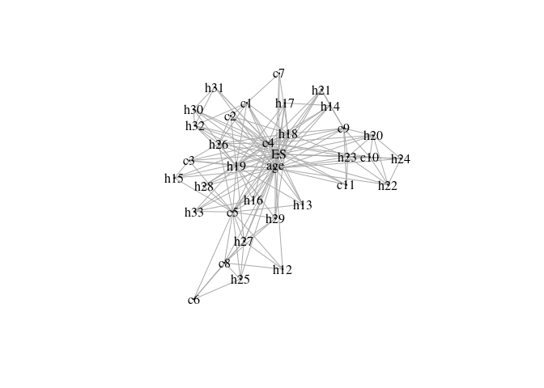

ess: Efficient Stepwise Selection in Decomposable Models
================

<!-- badges: start -->

[](https://github.com/mlindsk/ess/actions)
[](https://cran.r-project.org/package=ess)
<!-- badges: end -->

## About ess

The **ess** package is an **R** implementation of the algorithm
presented in [this paper](https://arxiv.org/abs/1301.2267) and later
corrected slightly [in this
paper](https://doi.org/10.1109/ictai.2004.100). The ESS algorithm is
used for model selection in discrete decomposable graphical models. It
is fast compared to other model selection procedures in **R**,
especially when data is high-dimensional.

## Decomposable Graphical Models

The class of graphical models is a family of probability distributions
for which conditional dependencies can be read off from a graph. If the
graph is decomposable, the maximum likelihood estimates of the
parameters in the model can be shown to be on exact form. This is what
enables ESS to be fast and efficient.

## Installation

You can install the current stable release of the package by using the
`devtools` package:

``` r
devtools::install_github("mlindsk/ess", build_vignettes = FALSE)
```

## Getting Started

The main function in **ess** is `fit_graph` which fits a decomposable
graph. An object returned from `fit_graph` is a `gengraph` object.
`fit_graph` has four types; forward selection (`fwd`), backward
selection (`bwd`), tree (`tree`) and a combination of tree and forward
(`tfwd`). Using `adj_lst` on an object returned by `fit_graph` gives the
adjacency list corresponding to the graph. Similarly one can use
`adj_mat` to obtain an adjacency matrix.

A neat usecase of **ess** is that of variable selection. Consider the
built-in data `derma` (dermatitis) with class variable `ES`. We can fit
a graph structure to this data, and inspect the graph to see which
variables `ES` directly depends upon:

``` r
library(ess)
g <- fit_graph(derma)
plot(g, vertex.size = 1)
```



Instead of inspecting the graph (it can be difficult if there are many
variables) we can simply extract the neighbors of `ES`

``` r
adj <- adj_lst(g)
adj$ES
#>  [1] "h21" "h20" "h28" "h33" "h16" "h29" "c9"  "h15" "h14" "c5"  "c3"  "h19"
#> [13] "h26" "c4"  "age" "c7"  "c2"  "h31" "c1"  "h18" "h17" "h32" "c11" "h13"
#> [25] "h23" "c10" "h22" "h24" "h30" "h27"
```

For more information, see the documentation. E.g. type `?fit_graph` in
an **R** session.

## See Also

The [molic](https://github.com/mlindsk/molic) package is used for
outlier detection in categorical data and is designed to work with
`gengraph` objects. One can use **ess** to fit a `gengraph` object,
extract the adjacency matrix, conert it to an `igraph` object and use it
in connection with belief propagation via the
[jti](https://github.com/mlindsk/jti) package.
